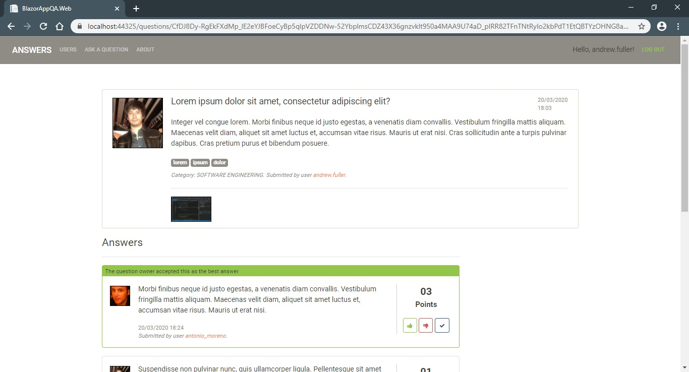
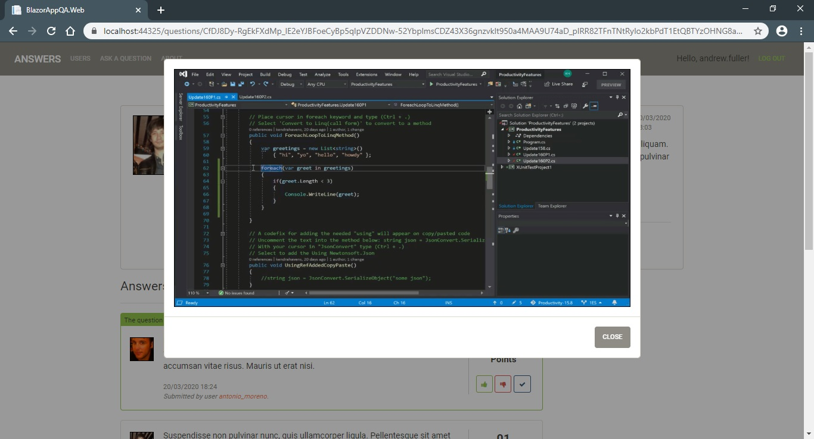

# Server-Side Blazor Q&A Website

Q&A Website developed using ASP.NET Core 3.1, Server-Side Blazor and Bootstrap 4.

## Technologies
- ASP.NET Core Blazor 3.1
- FluentValidation
- Entity Framework Core
- Microsoft SQL Server
- Bootstrap 4
- SweetAlert

## Screenshots

 
 

## Resources

- *[Introduction to ASP.NET Core Blazor](https://docs.microsoft.com/en-us/aspnet/core/blazor/?view=aspnetcore-3.1)*
